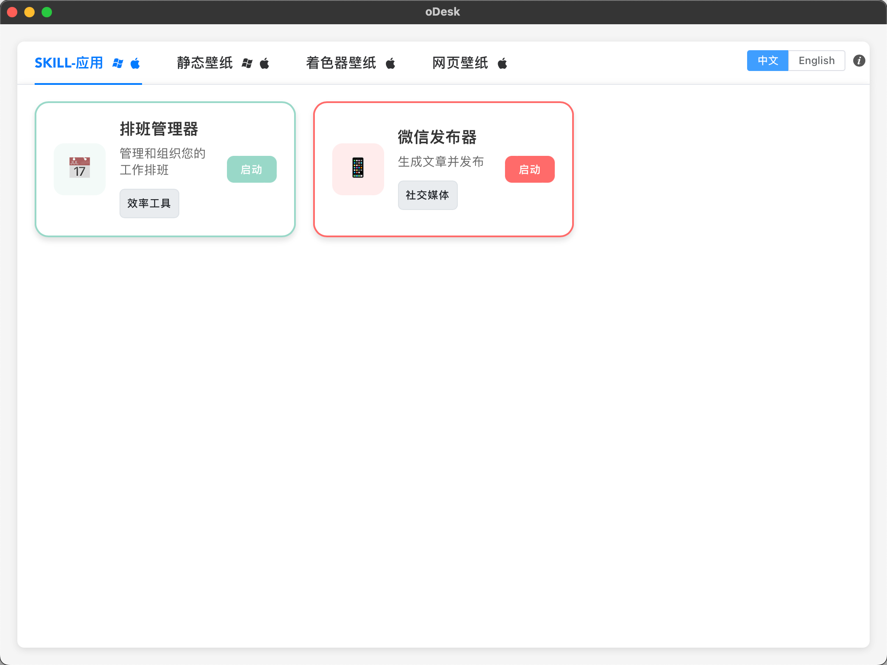

<p align="center">
    
</p>

<p align="center">
  <a href="README_EN.md">English</a> |
  <a href="README.md">简体中文</a>

</p>

<p align="center">
  <a href="https://opensource.org/licenses/MIT"></a>
  
   
  
</p>



## 🎖︎ 功能特性

### 1. Skill应用

- **应用管理界面**：提供可视化的技能应用管理平台，支持应用卡片展示和快速启动
- **内置应用**：
  - **排班管理器 (Schedule Manager)**：智能排班表生成工具，支持自定义员工数量、班次设置，可导出Excel文件
  - **微信发布器 (Wechat Publisher)**：微信公众号文章发布工具，支持AI生成文章、多种排版主题、一键发布
  - **音乐下载器 (Music Download)**：音乐搜索和下载工具，支持队列管理和本地播放
- **工作区管理**：创建和管理开发工作区，支持 opencode 服务执行
- **技能扩展**：支持通过技能包扩展应用功能，可导入导出技能配置
- **实时连接**：工作区状态实时监控，支持会话管理和文件操作

### 2. 静态壁纸

- 浏览本地壁纸列表，支持缩略图预览
- 支持从云端获取随机壁纸
- 支持壁纸轮播循环（本地/云端两种模式）
- 一键下载并设置系统壁纸
- 壁纸删除管理

### 3. Shader 着色器壁纸

- 内置着色器壁纸列表管理
- 支持创建新的着色器壁纸
- 实时预览着色器效果
- 内置 Monaco Editor 代码编辑器
- 基于 Babylon.js 的实时渲染预览
- 支持保存和删除着色器壁纸

### 4. HTML 网页壁纸

- 支持将任意网页设置为桌面壁纸
- 内置代码编辑器（Monaco Editor）
- 实时预览效果
- 支持截图生成封面
- 全屏预览模式
- 支持保存和删除 HTML 壁纸

## 📄 使用说明

1. **Skill应用**：在"SKILL-APPS"标签页中，可以访问各种技能应用
   - **排班管理器**：输入员工数量、月份和班次要求，AI自动生成最优排班表，支持导出Excel
   - **微信发布器**：配置微信公众号AppID和AppSecret，输入关键词搜索文章，AI生成内容并一键发布
   - **音乐下载器**：搜索音乐，管理下载队列，支持本地播放
2. **静态壁纸**：在"静态壁纸"标签页中，可以浏览本地壁纸、下载云端壁纸、设置壁纸轮播
3. **Shader 壁纸**：在"着色器壁纸"标签页中，可以创建、编辑和预览 GLSL 着色器
4. **HTML 壁纸**：在"网页壁纸"标签页中，可以将任意网页设为壁纸，支持实时编辑预览

## 🍟 HTML壁纸API

### 1. 引入 SDK

首先，请在你的自定义 HTML 壁纸中加载必须的 **SDK** 文件代码：

```javascript
// 这个是为了生成预览截图
<script src="https://cdn.jsdelivr.net/npm/html2canvas@1.4.1/dist/html2canvas.min.js"></script>
<script>
    const pendingCallbacks = new Map();

    const generateId = () =>
      "msg_" + Date.now() + "_" + Math.random().toString(36).substr(2, 9);

    window.addEventListener("message", async (event) => {
      const data = event.data;

      if (data && data.id) {
        const callback = pendingCallbacks.get(data.id);
        if (callback) {
          // 有回调，说明是壁纸请求客户端做的事情
          if (data.code === 200) {
            callback.resolve(data);
          } else {
            callback.reject(new Error(data.msg));
          }
          pendingCallbacks.delete(data.id);
        } else {
          // 没有回调，说明是客户端让壁纸做的事情
          switch (data.method) {
            case "screenshot":
              const canvas = await html2canvas(document.body, {
                backgroundColor: "#1a1a2e",
                scale: 0.5,
              });
              window.parent.postMessage(
                {
                  id: data.id,
                  method: data.method,
                  code: 200,
                  data: canvas.toDataURL("image/png"),
                },
                "*",
              );
              break;

            default:
              window.parent.postMessage(
                {
                  id: data.id,
                  method: data.method,
                  code: 404,
                  data: null,
                  msg: "unknown method",
                },
                "*",
              );
              break;
          }
        }
        return;
      }
    });

    // invoke函数用于发起请求让客户端执行事务
    async function invoke(data_type, payload) {
      return new Promise((resolve, reject) => {
        const id = generateId();
        pendingCallbacks.set(id, { resolve, reject });
        parent.postMessage({ id, method: data_type, payload }, "*");
        setTimeout(() => {
          if (pendingCallbacks.has(id)) {
            pendingCallbacks.delete(id);
            reject(new Error("Request timeout"));
          }
        }, 30000);
      });
    }
</script>
```

### 2. 调用接口

然后你可以通过如下**接口**获取数据/执行事务：

| 接口名称                     | 用途                               | 示例                                                                                   | 返回值   |
| :--------------------------- | :--------------------------------- | :------------------------------------------------------------------------------------- | :------- |
| `get_system_stats`           | 获取系统状态                       | `await invoke("get_system_stats");`                                                    | `Object` |
| `open_workspace`             | 打开当前工作空间文件夹             | `await invoke("open_workspace");`                                                      | -        |
| `opencode`                   | 基于当前工作空间执行 opencode 命令 | `await invoke("opencode");`                                                            | -        |
| `get`                        | 发起 GET 请求                      | `await invoke("get",{url: "http://127.0.0.1:4096/session"});`                          | `Object` |
| `postBody`                   | 发起 POST 请求                     | `await invoke("postBody", {url: "http://127.0.0.1:4096/session",data:{}});`            | `Object` |
| `workspace_file_insert_text` | 往当前工作空间文本文件新增数据     | `await invoke("workspace_file_insert_text", {fileName: "xxx.txt", newLine:"xxxxxx"});` | -        |
| `open_executable`            | 基于绝对路径打开本地程序           | `await invoke("open_executable", { path: "/Applications/Google Chrome.app" });`        | -        |

> 💡 实际案例请参照 `samples` 文件夹下的示例文件

## 📥 安装说明

```bash
# 克隆项目
git clone https://github.com/yourusername/oDesk.git

# 进入目录
cd oDesk

# 安装依赖
npm install

# 启动应用
npm run 4dev
```

## 🤝 贡献指南

欢迎提交 Issue 和 Pull Request！

### 提交 Issue

1. 搜索现有 Issue，确认是否已有相同问题
2. 使用清晰的问题描述，包含复现步骤
3. 附上相关截图和日志

### 提交 Pull Request

1. Fork 本项目
2. 创建功能分支 (`git checkout -b feature/xxx`)
3. 提交更改 (`git commit -m 'Add xxx'`)
4. 推送分支 (`git push origin feature/xxx`)
5. 创建 Pull Request

## �许可证

MIT License - 查看 [LICENSE](LICENSE) 了解详情

---

Made with ❤️ by oDesk Team
