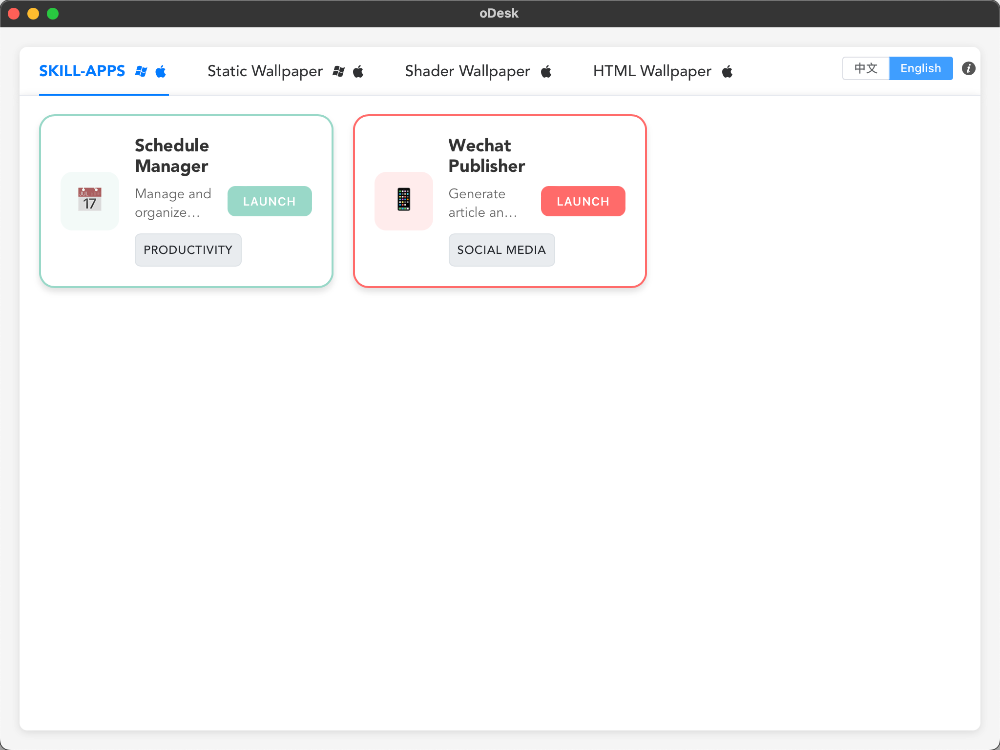
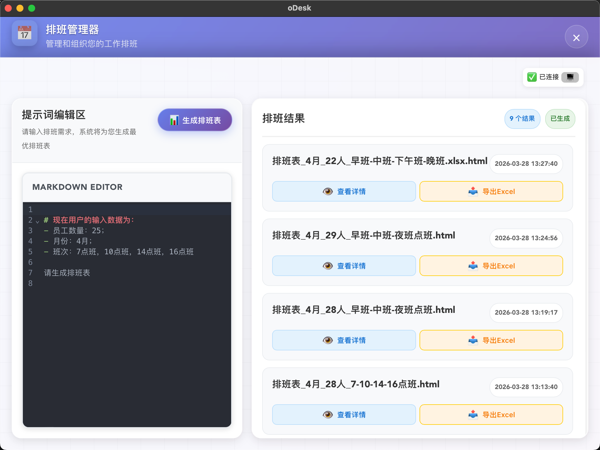
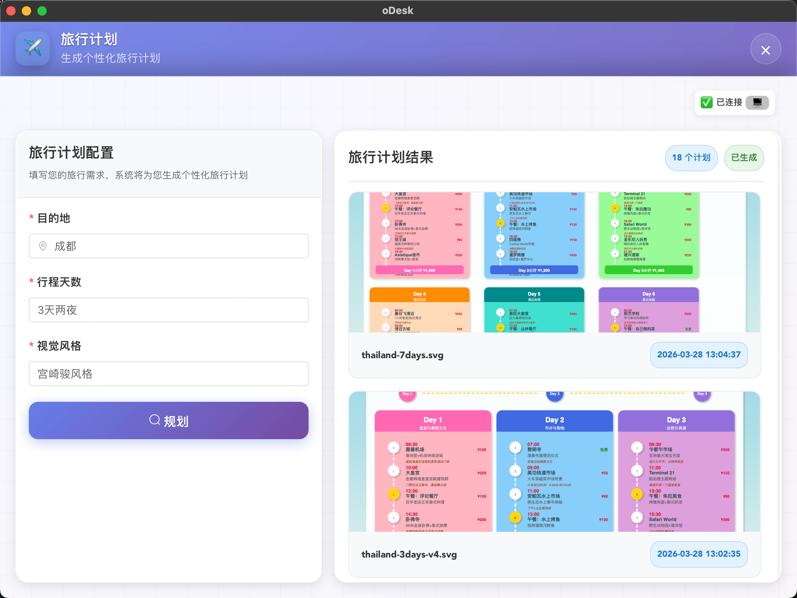
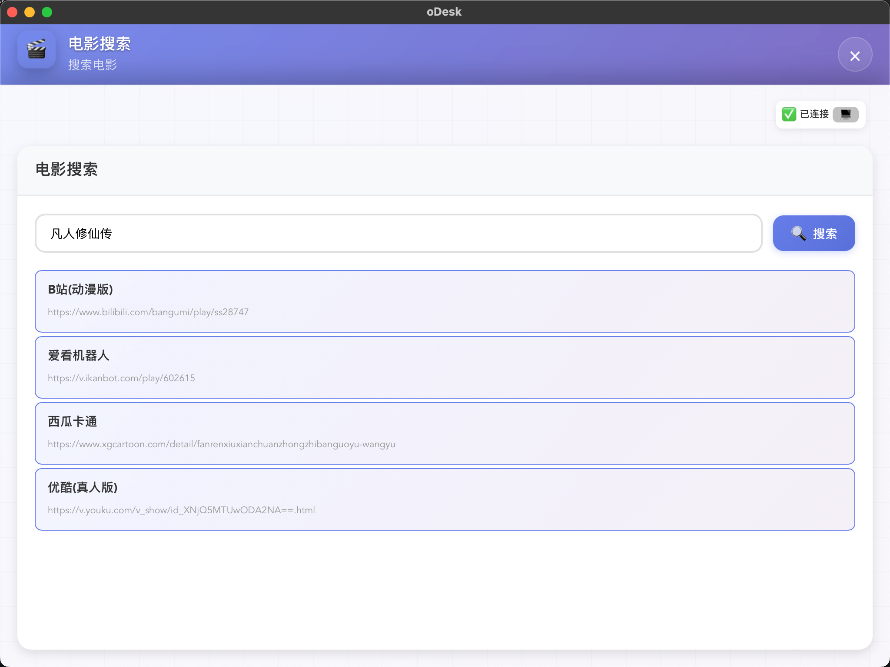
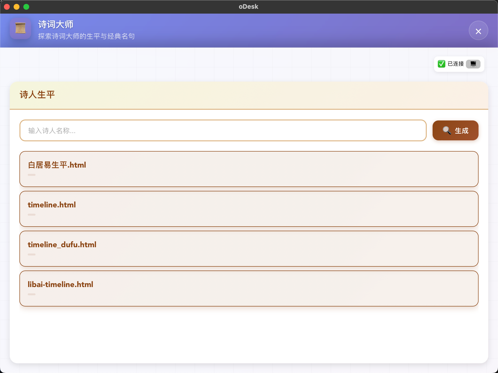
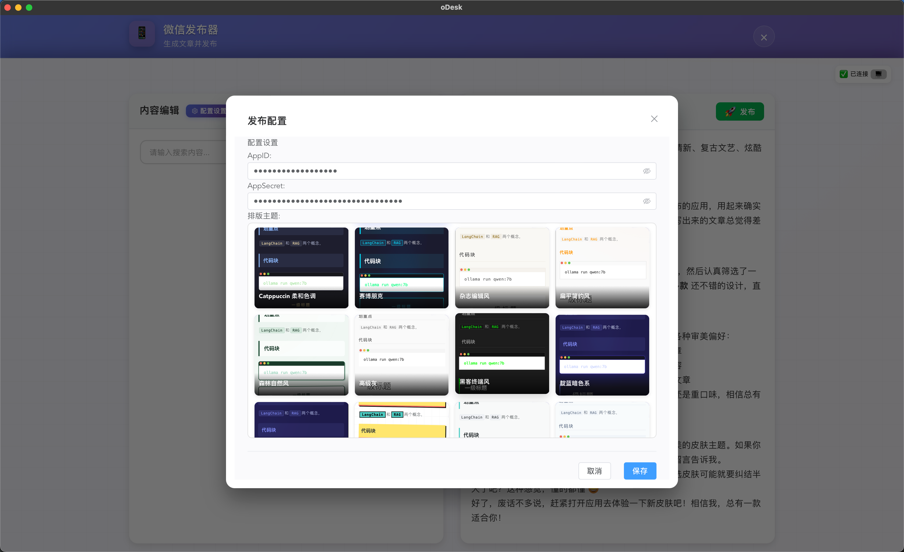

<p align="center">
    
</p>

<p align="center">
  <a href="README_EN.md">English</a> |
  <a href="README.md">简体中文</a>

</p>

<p align="center">
  <a href="https://opensource.org/licenses/MIT"></a>
  
  

</p>



## 🎖︎ Features

### 1. Skill Apps

- **App Management Interface**: Visual skill app management platform with app card display and quick launch
- **Built-in Apps**:
  - **Schedule Manager**: Intelligent scheduling tool with customizable employee count and shift settings, exportable to Excel
  - **Wechat Publisher**: WeChat public account article publishing tool with AI content generation, multiple themes, and one-click publishing
  - **Travel Plan**: Personalized travel plan generator with multiple visual styles and image types
  - **Movie Finder**: Movie search tool for quickly finding interesting films
  - **Ancien Poetry**: Explore the lives and classic verses of poetry masters, experiencing traditional cultural charm
- **Workspace Management**: Create and manage development workspaces with opencode service execution
- **Skill Extensions**: Extend app functionality through skill packs, with import/export configuration support
- **Real-time Connection**: Real-time workspace status monitoring with session management and file operations

<p align="center">
  
  
</p>
<p align="center">
  
  
</p>
<p align="center">
  
</p>

### 2. Static Wallpapers

- Browse local wallpaper list with thumbnail preview
- Get random wallpapers from cloud
- Wallpaper slideshow rotation (local/cloud modes)
- One-click download and set as system wallpaper
- Wallpaper deletion management

### 3. Shader Wallpapers

- Built-in shader wallpaper list management
- Create new shader wallpapers
- Real-time shader effect preview
- Built-in Monaco Editor code editor
- Real-time rendering preview based on Babylon.js
- Save and delete shader wallpapers

### 4. HTML Web Page Wallpapers

- Set any webpage as desktop wallpaper
- Built-in code editor (Monaco Editor)
- Real-time preview
- Screenshot for cover generation
- Fullscreen preview mode
- Save and delete HTML wallpapers

## 📄 Usage

1. **Skill Apps**: Access various skill apps in the "SKILL-APPS" tab
   - **Schedule Manager**: Enter employee count, month, and shift requirements for AI to generate optimal schedules, exportable to Excel
   - **Wechat Publisher**: Configure WeChat public account AppID and AppSecret, search articles by keywords, AI generates content for one-click publishing
   - **Travel Plan**: Enter destination, days and other requirements for AI to generate personalized travel plans with multiple visual styles
   - **Movie Finder**: Quickly search movie information and find interesting films
   - **Ancien Poetry**: Explore the lives and classic verses of ancient and modern poetry masters, experiencing traditional cultural charm
2. **Static Wallpapers**: Browse local wallpapers, download cloud wallpapers, and set slideshow in the "Static Wallpapers" tab
3. **Shader Wallpapers**: Create, edit, and preview GLSL shaders in the "Shader Wallpapers" tab
4. **HTML Wallpapers**: Set any webpage as wallpaper with real-time editing preview in the "Web Wallpapers" tab

## 🍟 HTML Wallpaper API

### 1. Import SDK

First, please load the required **SDK** file code in your custom HTML wallpaper:

```javascript
// This is for generating preview screenshots
<script src="https://cdn.jsdelivr.net/npm/html2canvas@1.4.1/dist/html2canvas.min.js"></script>
<script>
    const pendingCallbacks = new Map();

    const generateId = () =>
      "msg_" + Date.now() + "_" + Math.random().toString(36).substr(2, 9);

    window.addEventListener("message", async (event) => {
      const data = event.data;

      if (data && data.id) {
        const callback = pendingCallbacks.get(data.id);
        if (callback) {
          // Has callback, meaning wallpaper requests client to do something
          if (data.code === 200) {
            callback.resolve(data);
          } else {
            callback.reject(new Error(data.msg));
          }
          pendingCallbacks.delete(data.id);
        } else {
          // No callback, meaning client tells wallpaper to do something
          switch (data.method) {
            case "screenshot":
              const canvas = await html2canvas(document.body, {
                backgroundColor: "#1a1a2e",
                scale: 0.5,
              });
              window.parent.postMessage(
                {
                  id: data.id,
                  method: data.method,
                  code: 200,
                  data: canvas.toDataURL("image/png"),
                },
                "*",
              );
              break;

            default:
              window.parent.postMessage(
                {
                  id: data.id,
                  method: data.method,
                  code: 404,
                  data: null,
                  msg: "unknown method",
                },
                "*",
              );
              break;
          }
        }
        return;
      }
    });

    // invoke function is used to make requests for the client to execute operations
    async function invoke(data_type, payload) {
      return new Promise((resolve, reject) => {
        const id = generateId();
        pendingCallbacks.set(id, { resolve, reject });
        parent.postMessage({ id, method: data_type, payload }, "*");
        setTimeout(() => {
          if (pendingCallbacks.has(id)) {
            pendingCallbacks.delete(id);
            reject(new Error("Request timeout"));
          }
        }, 30000);
      });
    }
</script>
```

### 2. Call APIs

Then you can use the following **APIs** to get data/execute operations:

| API Name                     | Description                           | Example                                                                                | Return Value |
| :--------------------------- | :------------------------------------ | :------------------------------------------------------------------------------------- | :----------- |
| `get_system_stats`           | Get system status                     | `await invoke("get_system_stats");`                                                    | `Object`     |
| `open_workspace`             | Open current workspace folder         | `await invoke("open_workspace");`                                                      | -            |
| `opencode`                   | Execute opencode command in workspace | `await invoke("opencode");`                                                            | -            |
| `get`                        | Make GET request                      | `await invoke("get",{url: "http://127.0.0.1:4096/session"});`                          | `Object`     |
| `postBody`                   | Make POST request                     | `await invoke("postBody", {url: "http://127.0.0.1:4096/session",data:{}});`            | `Object`     |
| `workspace_file_insert_text` | Insert data into workspace text file  | `await invoke("workspace_file_insert_text", {fileName: "xxx.txt", newLine:"xxxxxx"});` | -            |
| `open_executable`            | Open local program by absolute path   | `await invoke("open_executable", { path: "/Applications/Google Chrome.app" });`        | -            |

> 💡 For practical examples, refer to the sample files in the `samples` folder

## 📥 Installation

```bash
# Clone the project
git clone https://github.com/yourusername/oDesk.git

# Navigate to directory
cd oDesk

# Install dependencies
npm install

# Start the app
npm run 4dev
```

## 🤝 Contributing

Welcome to submit Issues and Pull Requests!

### Submitting Issues

1. Search existing Issues to confirm if the problem already exists
2. Provide clear problem description with reproduction steps
3. Attach relevant screenshots and logs

### Submitting Pull Requests

1. Fork this project
2. Create a feature branch (`git checkout -b feature/xxx`)
3. Commit your changes (`git commit -m 'Add xxx'`)
4. Push the branch (`git push origin feature/xxx`)
5. Create a Pull Request

## 📜 License

MIT License - See [LICENSE](LICENSE) for details

---

Made with ❤️ by oDesk Team
