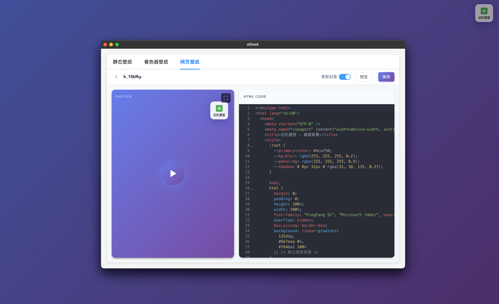

<p align="center">
    
</p>

<p align="center">
    A powerful dynamic desktop wallpaper management tool that supports multiple wallpaper types, including static wallpapers, Shader wallpapers, and HTML web wallpapers.
</p>

<p align="center">
  <a href="README_EN.md">English</a> |
  <a href="README.md">简体中文</a> 
</p>

<p align="center">
  <a href="https://opensource.org/licenses/MIT"></a>
  
  <a href="./examples/">
     
     </a>
</p>



## 📋 Table of Contents

- [Features](#-features)
- [Installation](#-installation)
- [Usage](#-usage)
- [HTML Wallpaper APIs](#-html-wallpaper-apis)
- [Contributing](#-contributing)
- [License](#-license)

## 🎖︎ Features

### 1. Static Wallpaper Management

- Browse local wallpaper list with thumbnail preview
- Fetch random wallpapers from cloud
- Wallpaper slideshow loop (local/cloud modes)
- One-click download and set system wallpaper
- Wallpaper deletion management

### 2. Shader Wallpapers

- Built-in shader wallpaper list management
- Create new shader wallpapers
- Real-time preview of shader effects
- Built-in Monaco Editor code editor
- Real-time rendering preview based on Babylon.js
- Save and delete shader wallpapers

### 3. HTML Web Wallpapers

- Set any webpage as desktop wallpaper
- Built-in code editor (Monaco Editor)
- Real-time preview
- Screenshot for cover generation
- Fullscreen preview mode
- Save and delete HTML wallpapers

### 4. Workspace Management (Currently only for HTML)

- Create and manage development workspaces
- Execute opencode service
- Workspace file editing functionality

## 📥 Installation

```bash
# Clone the repository
git clone https://github.com/yourusername/oDesk.git

# Navigate to directory
cd oDesk

# Install dependencies
npm install

# Start the application
npm run 4dev
```

## 📄 Usage

1. **Static Wallpapers**: In the "Static Wallpapers" tab, browse local wallpapers, download cloud wallpapers, and set up wallpaper slideshow
2. **Shader Wallpapers**: In the "Shader Wallpapers" tab, create, edit, and preview GLSL shaders
3. **HTML Wallpapers**: In the "Web Wallpapers" tab, set any webpage as wallpaper with real-time editing and preview

## 🍟 HTML Wallpaper APIs

### 1. Include SDK

First, please load the required **SDK** file code in your custom HTML wallpaper:

```javascript
// This is for generating preview screenshots
<script src="https://cdn.jsdelivr.net/npm/html2canvas@1.4.1/dist/html2canvas.min.js"></script>
<script>
    const pendingCallbacks = new Map();

    const generateId = () =>
      "msg_" + Date.now() + "_" + Math.random().toString(36).substr(2, 9);

    window.addEventListener("message", async (event) => {
      const data = event.data;

      if (data && data.id) {
        const callback = pendingCallbacks.get(data.id);
        if (callback) {
          // Has callback, meaning the wallpaper requested the client to do something
          if (data.code === 200) {
            callback.resolve(data);
          } else {
            callback.reject(new Error(data.msg));
          }
          pendingCallbacks.delete(data.id);
        } else {
          // No callback, meaning the client told the wallpaper to do something
          switch (data.method) {
            case "screenshot":
              const canvas = await html2canvas(document.body, {
                backgroundColor: "#1a1a2e",
                scale: 0.5,
              });
              window.parent.postMessage(
                {
                  id: data.id,
                  method: data.method,
                  code: 200,
                  data: canvas.toDataURL("image/png"),
                },
                "*",
              );
              break;

            default:
              window.parent.postMessage(
                {
                  id: data.id,
                  method: data.method,
                  code: 404,
                  data: null,
                  msg: "unknown method",
                },
                "*",
              );
              break;
          }
        }
        return;
      }
    });

    // invoke function is used to make requests to the client to execute tasks
    async function invoke(data_type, payload) {
      return new Promise((resolve, reject) => {
        const id = generateId();
        pendingCallbacks.set(id, { resolve, reject });
        parent.postMessage({ id, method: data_type, payload }, "*");
        setTimeout(() => {
          if (pendingCallbacks.has(id)) {
            pendingCallbacks.delete(id);
            reject(new Error("Request timeout"));
          }
        }, 30000);
      });
    }
</script>
```

### 2. Call APIs

Then you can use the following **interfaces** to get data or execute tasks:

| API Name                     | Purpose                                       | Example                                                                                  | Return Value |
| :--------------------------- | :-------------------------------------------- | :--------------------------------------------------------------------------------------- | :----------- |
| `get_system_stats`           | Get system status                             | `await invoke("get_system_stats");`                                                      | `Object`     |
| `open_workspace`             | Open current workspace folder                 | `await invoke("open_workspace");`                                                        | -            |
| `opencode`                   | Execute opencode command in current workspace | `await invoke("opencode");`                                                              | -            |
| `get`                        | Make a GET request                            | `await invoke("get",{url: "http://127.0.0.1:4096/session"});`                            | `Object`     |
| `postBody`                   | Make a POST request                           | `await invoke("postBody", {url: "http://127.0.0.1:4096/session",data:{}});`              | `Object`     |
| `workspace_file_insert_text` | Insert data into a text file in workspace     | `await invoke("workspace_file_insert_text", {file_name: "xxx.txt", new_line:"xxxxxx"});` | -            |
| `open_executable`            | Open a local application by absolute path     | `await invoke("open_executable", { path: "/Applications/Google Chrome.app" });`          | -            |

> 💡 For practical examples, please refer to the sample files in the `samples` folder

## 🤝 Contributing

Contributions are welcome! Please feel free to submit Issues and Pull Requests.

### Submitting Issues

1. Search existing Issues to check if the problem already exists
2. Use a clear problem description with reproduction steps
3. Include relevant screenshots and logs

### Submitting Pull Requests

1. Fork the repository
2. Create a feature branch (`git checkout -b feature/xxx`)
3. Commit your changes (`git commit -m 'Add xxx'`)
4. Push to the branch (`git push origin feature/xxx`)
5. Create a Pull Request

## 📄 License

MIT License - See [LICENSE](LICENSE) for details

---

Made with ❤️ by oDesk Team
